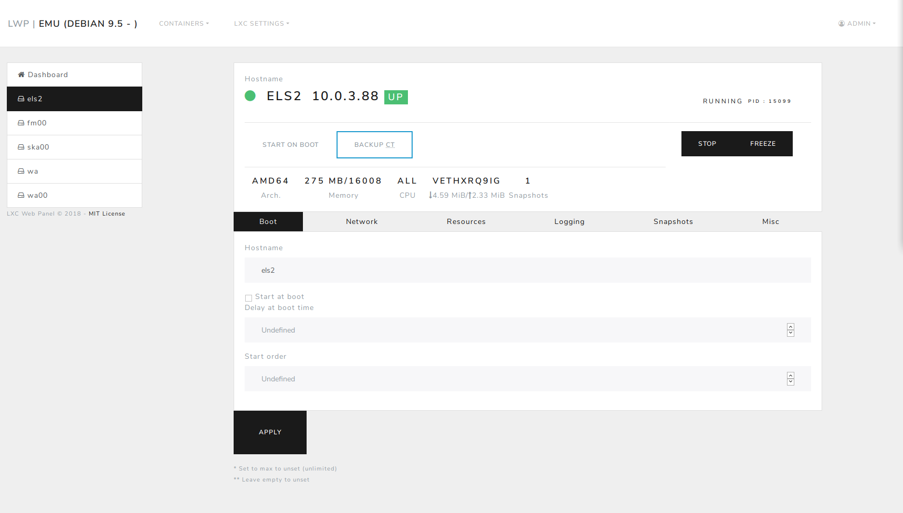
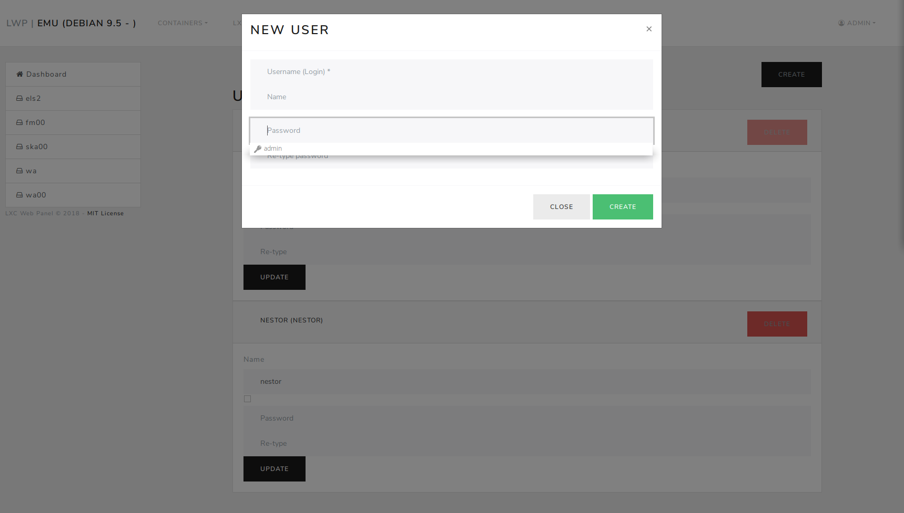
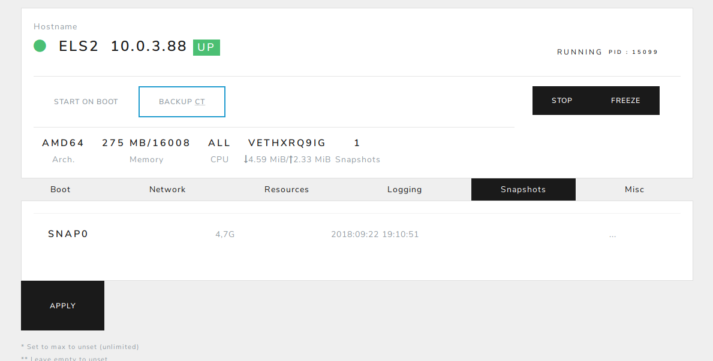

DONT USE UNTIL issue #2 IS COMPLETED

LXC-Web-Panel reloaded
==========================

.. image:: https://travis-ci.org/EstudioNexos/LXC-Web-Panel.svg?branch=master
    :target: https://travis-ci.org/EstudioNexos/LXC-Web-Panel

.. image:: https://github.com/EstudioNexos/LXC-Web-Panel/raw/master/screenshots/dashboard.png
  :width: 400
  :alt: Revamped dashboard
  
 
This is a fork of the original LXC-Web-Panel from https://github.com/lxc-webpanel/LXC-Web-Panel and https://github.com/claudyus/LXC-Web-Panel/ looking for LXC 2.x compatibility, UI updating, New features like snapshots and backup restore management, and Fabric (fabfile) integration to be able to manage remote hosts.

Some features from Claudyus may fell off like Filebucket backups (not updated since 2015), probably LDAP integration (as we have no means to test it), and some more.

If you use this fork please ensure to use at least lxc 2.0.7. The code was tested on Debian 9.5 Stretch.

We are working on this heavily so expect frequent changes in code, installation docs outdated, ... 

All contributions are welcomed.

  

Installation from source code
----------------------------------------------

If you want to run lwp from source code:

::
  mkdir gantry && cd gantry
  python3 -m venv gantryenv
  source gantryenv/bin/activate
  git clone https://github.com/EstudioNexos/LXC-Web-Panel.git
  cd LXC-Web-Panel
  pip install cryptography # installing pyopenssl fails if cryptography is not already installed
  python setup.py install
  mkdir /etc/lwp && mkdir /var/lwp
  cp lwp.example.conf /etc/lwp/lwp.conf #default auth database user admin/admin
  cp lwp.db /var/lwp/lwp.db
  ./bin/lwp --debug        # run lwp wth debug support

Configuration
-------------

1. Copy /etc/lwp/lwp.example.conf to /etc/lwp/lwp.conf
2. edit it
3. start lwp service as root ``service lwp start``

Your lwp panel is now at http://localhost:5000/ and default username and password are admin/admin.

Authentication methods
^^^^^^^^^^^^^^^^^^^^^^

Default authentication is against the internal sqlite database, but it's possible to configure alternative backends.

LDAP
++++

To enable ldap auth you should set ``auth`` type to ``ldap`` inside your config file then configure all options inside ldap section.
See lwp.example.conf for references.

Pyhton LDAP need to be installed::

  apt-get install python-ldap

htpasswd
++++++++

To enable authentication against htpasswd file you should set ``auth`` type to ``htpasswd`` and ``file`` variable in ``htpasswd`` section to point to the htpasswd file.

This backend use the crypt function, here an example where ``-d`` force the use of crypt encryption when generating the htpasswd file::

  htpasswd -d -b -c /etc/lwp/httpasswd admin admin

PAM
+++

To enable authentication against PAM you should set ``auth`` type to ``pam`` and ``service`` variable in ``pam`` section.
Python PAM module needs to be installed::

  apt-get install python-pam

or

::

  pip install pam

or

::

  yum install python-pam

With default ``login`` service all valid linux users can login to lwp.
Many more options are available via PAM Configuration, see PAM docs.

HTTP
+++++

This auth method is used to authenticate the users using an external http server through a POST request. To enable this method  ``auth`` type to ``http`` and configure the option under ``http`` section.

Custom autenticators
++++++++++++++++++++

If you want to use different type of authentication, create appropriate file in ``authenticators/`` directory with specific structure (example can be viewed in ``stub`` authenticator)

Developers/Debug
----------------

After a fresh git clone you should download the bower component and setup the package for development purpose.

::

 fab build_assets
 sudo ./setup.py develop
 cp lwp.example.conf lwp.conf

Now you can run lwp locally using ``sudo ./bin/lwp --debug``

Debug is just one of the available options to profile lwp you can use ``--profiling`` options, those options can also be
used against the global installation using: ``sudo lwp --debug``

Anyway ensure to stop the lwp service if any: ``sudo service lwp stop``

To run test locally unsure that mock-lxc scripts are in PATH (``export PATH=`pwd`/tests/mock-lxc:$PATH``) than run ``fab dev_test``

To build a local debian package run ``fab debian``

LICENSE
-------
This work is released under MIT License, see LICENSE file.
